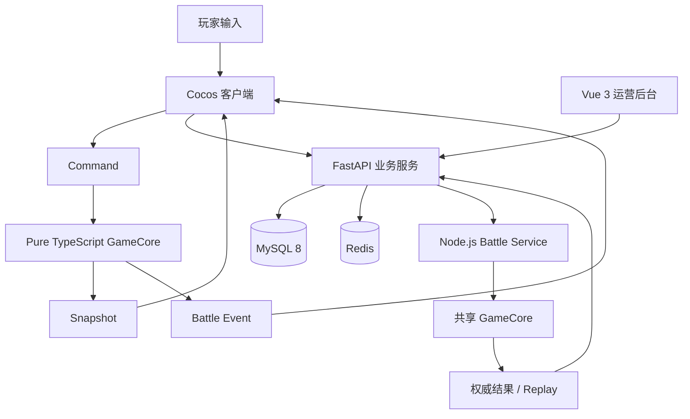

# 飞船经营策略游戏：项目规范总览

> **技术基线**：Cocos Creator 3.8.8 + TypeScript  
> **客户端定位**：Cocos 负责全部可见游戏画面与 UI；游戏规则由纯 TypeScript `GameCore` 负责  
> **服务端**：FastAPI + MySQL 8 + Redis；权威战斗使用 Node.js + TypeScript 共享 `GameCore`  
> **正式首发平台**：Windows Native；Web Desktop 仅用于 R0/R1 开发预览与自动验证  
> **文档用途**：项目开发、GPT-5.6 / Codex 协作、代码审查、测试与验收的统一依据  
> **当前阶段**：R1 客户端基础重构（R0 历史基线已冻结）
> **版本**：V0.6（客户端重基线版）
> **日期**：2026-08-12

---

## 1. 这套文档怎么用

本目录采用“**一个主题只有一个主文档**”原则，避免同一规则在多个文件重复维护。

### 推荐阅读顺序

1. `README.md`：先看项目总览与文档地图。
2. `AGENTS.md`：所有 GPT / Codex / 开发人员都必须先读。
3. `docs/00-产品定位与版本路线.md`：确认做什么、不做什么。
4. `docs/01-总体技术架构.md`：确认客户端、GameCore、后端的边界。
5. `docs/02-仓库与目录规范.md`：创建或调整目录前必读。
6. `docs/03-复用优先与依赖策略.md`：新增组件/工具/依赖前必读。
7. 根据当前任务进入对应业务模块文档。
8. 开发完成后对照 `docs/16-测试-验收-DoD.md`。

---

## 2. 项目核心架构

### 不可突破的边界

- **Cocos Node / Component 不是游戏真实状态。**
- **GameCore 禁止引用 `cc`、DOM、Node.js API。**
- **客户端战斗结果不可信，联网版本由服务端复算。**
- **确定性逻辑禁止直接使用 `Math.random()`。**
- **渲染帧率不得影响战斗结果。**
- **同一配置、同一 Seed、同一 Commands 必须得到同一结果。**

---

## 3. “不要重复造轮子”总原则

新增代码前按以下顺序判断：

1. **项目内是否已经有同类模块？** 有则复用或扩展。
2. **Cocos 是否已有成熟内置能力？** 有则优先使用。
3. **JavaScript / TypeScript 标准能力是否足够？** 足够则不引入依赖。
4. **是否存在成熟、轻量、兼容 Cocos/Web/Native 的第三方库？** 评估后再引入。
5. **只有项目特有规则**（如确定性战斗、船舱导航、条件 AI）才自行实现。

禁止为了“代码看起来统一”而重写 Cocos 已有的 Button、Widget、Layout、ScrollView、Mask、Tween、Animation、Prefab、Asset Bundle、Audio、输入事件等基础能力。

> 例外：如果 Cocos 内置控件不能满足性能或确定性要求，可以在其上封装一层**项目适配器**，而不是复制一整套底层能力。

详细规则见：`docs/03-复用优先与依赖策略.md`。

---

## 4. 文档地图（唯一事实源）

| 主题 | 唯一主文档 |
|---|---|
| 产品定位、核心循环、R0-R3 | `docs/00-产品定位与版本路线.md` |
| 总体架构、GameCore边界、Command/Event/Snapshot | `docs/01-总体技术架构.md` |
| 仓库结构、目录职责、命名 | `docs/02-仓库与目录规范.md` |
| 复用、依赖、禁止重复造轮子 | `docs/03-复用优先与依赖策略.md` |
| Cocos场景、UI层级、页面 | `docs/04-Cocos客户端与UI架构.md` |
| Asset Bundle、Prefab、美术资源 | `docs/05-资源与Prefab规范.md` |
| 网格、船体、房间、能源 | `docs/06-GameCore与飞船基础系统.md` |
| 船员、导航图、寻路 | `docs/07-船员与寻路系统.md` |
| 战斗、伤害、武器、防御、状态 | `docs/08-战斗与状态系统.md` |
| AI、弹药、无人机、研究、装备 | `docs/09-AI与扩展玩法系统.md` |
| PvE、PvP、Replay、存档 | `docs/10-PvE-PvP-回放-存档.md` |
| 配置、版本、发布 | `docs/11-配置数据与版本管理.md` |
| FastAPI、Battle Service、API、数据库、安全 | `docs/12-服务端-API-数据库.md` |
| Web、输入、音频、性能 | `docs/13-Web-输入-音频-性能.md` |
| 调试、日志、异常 | `docs/14-调试-日志-错误处理.md` |
| Cocos/TypeScript编码、中文注释 | `docs/15-编码与注释规范.md` |
| 单测、确定性测试、验收、DoD | `docs/16-测试-验收-DoD.md` |
| R0/R1任务顺序、风险、第一条任务 | `docs/17-里程碑与任务顺序.md` |
| 外部资料 | `docs/18-参考资料.md` |
| Cocos 创作工具可识别类型接入 | `docs/19-Cocos创作工具类型接入规范.md` |
| 原总纲章节迁移映射 | `docs/99-原总纲章节映射.md` |
| Cocos 编辑器创作工具插件化决策 | `docs/ADR-0001-Cocos编辑器创作工具插件化.md` |
| Cocos 编辑器创作入口收敛决策 | `docs/ADR-0003-Cocos编辑器创作入口收敛.md` |
| Windows 正式发行、签名启动器与版本验证决策 | `docs/ADR-0002-Windows正式发行与服务端版本验证.md` |
| R1 三场景、共享 UI、多舰、玩家状态与服务器边界 | `docs/ADR-0004-R1客户端重基线与服务器边界.md` |
| UIRoot 模块 Prefab 拆分与动态页面生命周期 | `docs/ADR-0005-UI模块Prefab拆分与动态页面生命周期.md` |

---

## 5. 当前开发目标

R0 的第一条 20×10 网格任务已经完成并冻结。当前执行 `R1-FOUNDATION-CHECKLIST.md`：

- GameCore 使用 `HullDefinition + ShipModel` 支持不同网格与非矩形 Mask；
- 运行场景固定为 `BootScene / MainScene / BattleScene`；
- Main/Battle 复用 `UIRoot.prefab`，敌我复用 `ShipView.prefab`；
- 开发期 UI 只依赖 `PlayerStatePort`，使用单一玩家状态 Envelope；
- 完成 Creator 持久资产和正式 Web Desktop 重新验收后，再进入维修系统。

登录、商城、公会、赛季、联网经济和正式 Windows 发行仍属于后续阶段。

---

## 6. 关键开发规则摘要

- 所有核心模型使用稳定字符串 ID。
- GameCore 只存可序列化数据，不存 Cocos Node。
- Cocos Component 负责“显示”和“输入适配”，不负责最终战斗规则。
- 所有需要设计人员调整的场景、Prefab 和视觉参数必须在 Cocos 编辑器中可见可改；Inspector 面向设计人员的属性名称和提示使用中文。
- 网格化内容在编辑器内拖动时自动吸附到逻辑网格，运行时仍由 GameCore 校验并保存整数逻辑坐标。
- 网格尺寸、有效格 Mask 和容量只来自 `HullDefinition`；Scene/Prefab 只保存表现参数和引用。
- 批量创建、校验和未来关卡导出统一通过项目级 Cocos 扩展；插件只负责创作，关闭后不得影响运行与构建。
- 房间 Prefab 只保存表现与稳定定义 ID；P8 起九张运行时 CSV 是唯一权威规则源，`editor-prefabs.csv` 只保存编辑器映射。
- 高频重复对象使用 Prefab + 对象池或数据驱动实例化。
- 大列表需要虚拟化；优先封装统一 VirtualList，不允许每个页面自己实现。
- 所有非显而易见的公共接口、算法和关键约束必须有**中文注释**。
- 中文注释重点解释“为什么”和“不变量”，避免逐行翻译代码。
- 新增依赖、全局服务、通用组件前必须先搜索现有工程，避免重复实现。
- 重要玩法改动必须更新对应唯一主文档和测试。
- R1 的 Web 包和源 JSON 只用于开发验证；未来正式 Windows 包与服务器按 ADR-0002 重新实现并完成真实部署验收。
