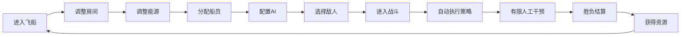
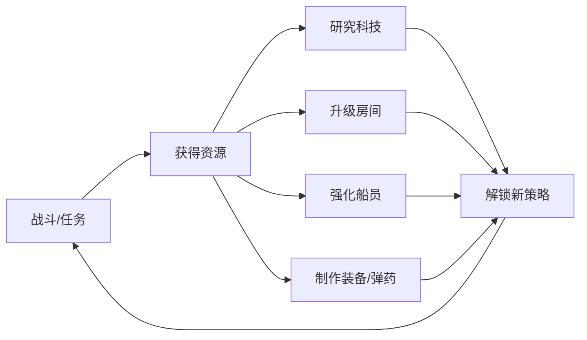

# 产品定位与版本路线

> **文档规则**：本文件是该主题的唯一主文档；其他文档如需使用本主题规则，应通过链接引用，不复制整段内容。  
> **中文注释**：涉及关键数据结构、算法、不变量、兼容逻辑的代码必须使用中文注释解释原因。  


# 1. 项目定位

## 1.1 游戏类型

2D 横截面飞船经营策略游戏，核心组合为：

- 飞船建造与布局；
- 房间系统；
- 有限能源分配；
- 船员招募、培养与调度；
- 房间/船员情境 AI；
- 自动化横截面战斗；
- 武器、护盾、引擎、传送、无人机等战斗系统；
- PvE；
- 异步 PvP；
- 科技研究；
- 装备与库存；
- 长期成长与运营内容。

参考产品的公开介绍中，核心玩法包括自定义飞船、招聘船员、控制有限资源、横截面战斗、探索、研究以及为房间和船员设置情境 AI；近年的更新仍在持续扩展 AI 条件、房间、布局保存和战斗能力。因此本项目必须从第一天采用**数据驱动、模块化、可版本化规则系统**。

## 1.2 核心玩家体验

玩家不是直接操作每一发攻击，而是扮演“舰长/系统设计者”：

1. 设计飞船；
2. 安装房间；
3. 配置有限能源；
4. 安排船员；
5. 配置 AI 行为；
6. 选择战斗策略；
7. 进入战斗；
8. 观察系统按策略运行；
9. 临场进行有限人工干预；
10. 根据战斗结果继续升级与调整方案。

## 1.3 核心设计支柱

### 支柱 A：布局决定能力

飞船内部空间有限，不同房间占据不同网格。

玩家需要在火力、防御、能源、医疗、维修、机动、登舰、无人机、仓储之间做取舍。

### 支柱 B：资源永远有限

能源、空间、船员、弹药、冷却时间不能同时满足所有系统。

核心策略来源于“有限资源如何分配”。

### 支柱 C：AI 是核心玩法，不是辅助功能

AI 规则需要成为主要策略表达方式：

> 当【条件】满足时 → 执行【动作】

玩家通过调整优先级、目标、阈值和动作，形成不同战术流派。

### 支柱 D：战斗结果必须可解释

玩家应能理解失败原因，例如：

- 能源不足；
- 武器目标错误；
- 船员没有及时维修；
- 医疗室断电；
- AI 优先级冲突；
- 传送队被集火；
- 护盾恢复不足。

因此必须提供房间状态、目标线、船员任务状态、战斗日志、战斗报告和回放。

### 支柱 E：数据驱动长期扩展

增加新内容时，优先新增数据配置，不修改核心流程。

---

---

# 2. 版本范围规划

## 2.1 R0：技术验证原型

目标：证明 Cocos + TypeScript 技术路线成立。

包含：

- 20×10 飞船逻辑网格；
- 1 种船体；
- 1 个 2×2 房间；
- Cocos 编辑器中可直接搭建并预览网格与房间；
- 设计参数使用中文 Inspector，编辑器拖动房间自动吸附逻辑格；
- 房间拖放；
- 越界检测；
- 重叠检测；
- 飞船画面缩放；
- 飞船画面拖动；
- JSON 保存；
- localStorage 恢复；
- Web Desktop 构建。

不包含：后端、登录、船员、战斗、AI、装备、商店。

## 2.2 R1：核心玩法 MVP

目标：完成完整“设计飞船 → 配置 → 战斗 → 结算”闭环。

建议内容量：

- 1～2 种船体；
- 8～10 种房间；
- 6～10 名船员模板；
- 2 类武器；
- 护盾；
- 引擎；
- 医疗；
- 维修；
- 电梯；
- 12～20 个 AI 条件；
- 8～12 个 AI 动作；
- 3～5 个 PvE 敌人；
- 本地战斗回放；
- 本地存档。

R1 不做大型 MMO 功能。

## 2.3 R2：联网 Alpha/Beta

增加：

- 账号；
- 云存档；
- 服务端配置；
- 玩家库存；
- 任务；
- 研究；
- 邮件；
- 商店；
- Node.js 权威战斗服务；
- 异步 PvP；
- 排名；
- 战斗记录；
- 管理后台；
- 基础数据统计。

正式发行前置能力：

- Cocos Creator 3.8.8 Windows Native Release；
- 独立签名启动器、Authenticode 和签名安装器；
- 启动时请求服务端最新签名文件清单；
- 核心文件全量 Hash、普通资源增量 Hash；
- AES-256-GCM 规则包与 Cocos Native 脚本加密；
- 短时 Launch Ticket、配置 Bootstrap 和密钥轮换；
- 文件异常禁止启动并引导从正式渠道重新安装；
- 网络不可用时仅允许已验签版本离线冷启动，不允许绕过服务端明确拒绝；
- Node Battle Service 和 FastAPI 对账号、库存、奖励、布局与战斗结果保持权威。

R0/R1 的 Web Desktop 构建仍是开发与回归验证目标，不作为商业正式发行包。详细决策见 `ADR-0002-Windows正式发行与服务端版本验证.md`。

## 2.4 R3：长期运营版本

按实际运营需求逐步增加：

- 更多船体、房间、船员；
- 装备；
- 弹药制造；
- 无人机/战斗艇；
- 科技树；
- 星系任务与探索；
- 舰队/公会；
- 赛事与赛季；
- 活动；
- 玩家市场；
- 社交；
- 皮肤与船体装饰；
- 多套飞船布局方案；
- 更复杂 AI；
- PvE Boss；
- 多阶段战斗。

---

---

# 3. 游戏核心循环

## 3.1 单局循环



## 3.2 中期成长循环



## 3.3 长期循环

```text
提升舰船等级
→ 解锁更大船体
→ 获得更多房间类型
→ 获取更强船员
→ 解锁新AI条件/动作
→ 构建不同流派
→ 挑战更高等级内容
```

---
