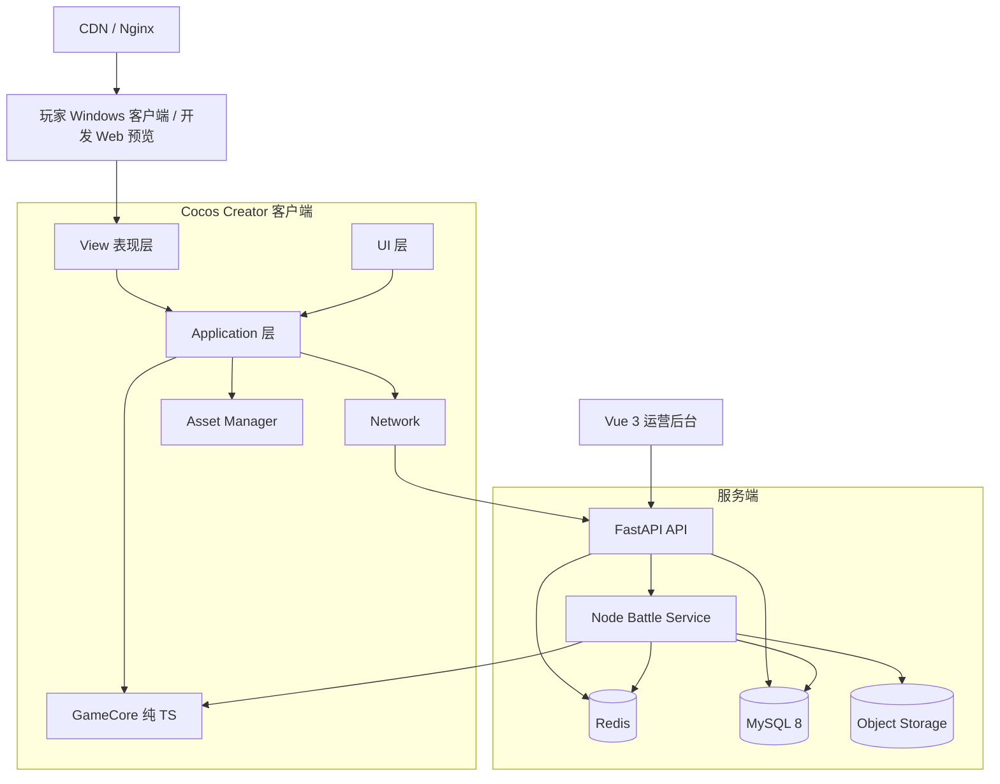

# 总体技术架构

> **文档规则**：本文件是该主题的唯一主文档；其他文档如需使用本主题规则，应通过链接引用，不复制整段内容。  
> **中文注释**：涉及关键数据结构、算法、不变量、兼容逻辑的代码必须使用中文注释解释原因。  


## 阅读提示

本文件只定义**系统边界和核心架构原则**。目录职责见 `02-仓库与目录规范.md`；具体玩法规则见对应模块文档。

# 4. 总体技术架构

## 4.1 技术栈

| 层级 | 技术 | 说明 |
|---|---|---|
| 游戏客户端 | Cocos Creator 3.8.8 | 正式 Windows Native；Web Desktop 用于开发预览与回归 |
| 客户端语言 | TypeScript | 全部客户端业务代码 |
| 游戏规则内核 | Pure TypeScript | 不依赖 `cc`、DOM、Node.js |
| API 服务 | FastAPI | 账号、库存、任务、成长、运营业务 |
| 权威战斗服务 | Node.js + TypeScript | 运行同一套 GameCore |
| 数据库 | MySQL 8 | 持久化 |
| 缓存/队列 | Redis | 会话、缓存、排行榜、锁、任务 |
| 运营后台 | Vue 3 + TypeScript + Tailwind CSS | 配置和 GM |
| 静态资源 | Nginx + CDN | Web 构建和 Asset Bundle |
| 对象存储 | S3 兼容对象存储 | 回放、日志、大型资源 |
| Windows 启动入口 | C++20 + Win32 API | Authenticode、HTTPS 清单、RSA 验签、文件 Hash、Launch Ticket |

## 4.2 总体架构图



正式 Windows 启动链位于 Cocos 进程之前：

```text
已签名 Launcher
→ WinTrust 验证自身
→ HTTPS 获取服务端最新签名清单
→ RSA-PSS 验签
→ CORE 全量 Hash / BULK 增量 Hash
→ 短时 Launch Ticket
→ Cocos Windows Native
→ 玩家会话 + 配置 Bootstrap
```

启动器只建立发布文件信任，不决定玩家数据或战斗结果。完整决策见 `ADR-0002-Windows正式发行与服务端版本验证.md`。

---

---

# 5. 最重要的架构原则

## 5.1 Cocos 不是游戏规则来源

禁止：

```text
RoomView 自己计算真实伤害
CrewView 自己决定真实寻路
WeaponView 直接修改敌舰HP
Button 点击直接增加货币
```

正确：

```text
玩家输入
↓
Command
↓
GameCore
↓
新的 GameState + BattleEvent
↓
Cocos View 播放表现
```

### Cocos 编辑器是表现搭建入口

Scene、Prefab、节点层级、UI 骨架、初始布局和视觉参数以 Cocos 编辑器为正式搭建入口；运行时 Bootstrap 只做依赖连接和数据绑定。编辑器中的位置必须转换为 GameCore 整数逻辑坐标，不能成为权威状态。具体规则见 `05-资源与Prefab规范.md`。

### Cocos 编辑器扩展是创作适配层

```text
设计人员
↓
starship-editor-tools（菜单 / 表单 / 校验 / 导出）
↓
Prefab 表现 + 版本化 JSON 规则 + Scene 创作布局
↓
Application / Adapter
↓
Pure TypeScript GameCore
```

- 全项目只保留一个项目级编辑器扩展宿主，房间、NPC、关卡按领域分模块。
- 插件只能生成和校验创作资产，不能成为运行时服务或权威状态来源。
- 插件只调用 Cocos Creator 3.8 公开扩展 API；禁止直接修改 `.scene`、`.prefab`、`.meta` 文本。资源管理器右键只创建 JSON + Prefab，场景骨架、房间实例和校验统一由可停靠“星舰创作工具”面板完成；层级选择只作为面板上下文。禁止私有 hierarchy API、`cce.*` 和 DOM 注入。
- 插件关闭、加载失败或未安装时，游戏运行、存档、测试和 Web/Native 构建必须继续工作。
- Prefab 保存表现与 Cocos 引用；版本化 JSON 保存稳定 ID 和规则数据；Scene 保存可视化初始布局。
- 语义化创作入口不建立万能实体编辑器：资源菜单负责定义 JSON + Prefab，创作面板负责标准骨架和已发现 Prefab 的场景实例；领域模块只在进入对应里程碑后注册。

架构决策见 `ADR-0003-Cocos编辑器创作入口收敛.md`，具体创作流程见 `05-资源与Prefab规范.md`。

## 5.2 GameCore 必须纯 TypeScript

`game-core` 中禁止引用：

```ts
import { Node } from 'cc';
import { Sprite } from 'cc';
import { Vec3 } from 'cc';
```

也禁止依赖：DOM、Canvas、localStorage、fetch、Node.js `fs/path`、系统时间作为战斗逻辑依据。

GameCore 只处理：数值、ID、状态、Command、Event、Snapshot、Tick、Seed RNG。

## 5.3 确定性模拟

相同的游戏规则版本、初始状态、Seed、Command 序列必须得到相同最终结果。

统一使用：

```ts
interface RandomSource {
  next(): number;
  nextInt(min: number, max: number): number;
}
```

禁止在核心逻辑中直接使用：

```ts
Math.random();
```

## 5.4 固定 Tick

建议：

```text
GameCore：20 Tick / 秒
Cocos Render：30 / 60 FPS
```

渲染帧率不能影响装填、冷却、移动、DOT、AI、战斗胜负。

## 5.5 Command / Event / Snapshot

### Command

玩家或 AI 的意图：

```ts
type GameCommand =
  | { type: 'MOVE_CREW'; crewId: string; roomId: string }
  | { type: 'SET_ROOM_POWER'; roomId: string; power: number }
  | { type: 'SET_WEAPON_TARGET'; roomId: string; targetRoomId: string }
  | { type: 'USE_ABILITY'; crewId: string; abilityId: string };
```

### Event

已经发生的事实：

```ts
type GameEvent =
  | { type: 'CREW_MOVE_STARTED'; crewId: string; from: string; to: string }
  | { type: 'WEAPON_FIRED'; weaponId: string; targetRoomId: string }
  | { type: 'PROJECTILE_HIT'; projectileId: string; targetRoomId: string }
  | { type: 'ROOM_DAMAGED'; roomId: string; value: number }
  | { type: 'CREW_DAMAGED'; crewId: string; value: number }
  | { type: 'BATTLE_FINISHED'; winnerId: string };
```

### Snapshot

供 UI/渲染消费的只读状态：

```ts
interface BattleSnapshot {
  tick: number;
  playerShip: ShipBattleSnapshot;
  enemyShip: ShipBattleSnapshot;
}
```

---

---

# 56. 当前最终技术决策

```text
客户端：
Cocos Creator 3.8.8 + TypeScript

游戏UI：
全部使用 Cocos UI / Node / Prefab 实现

核心逻辑：
Pure TypeScript GameCore

业务API：
FastAPI

数据库：
MySQL 8

缓存：
Redis

权威战斗：
Node.js + TypeScript + 共享 GameCore

运营后台：
Vue 3 + TypeScript + Tailwind CSS

正式首发：
Windows Native（签名启动器 + 服务端版本验证）

开发预览：
Web Desktop

后续评估：
Web Mobile / Android / iOS
```

---
