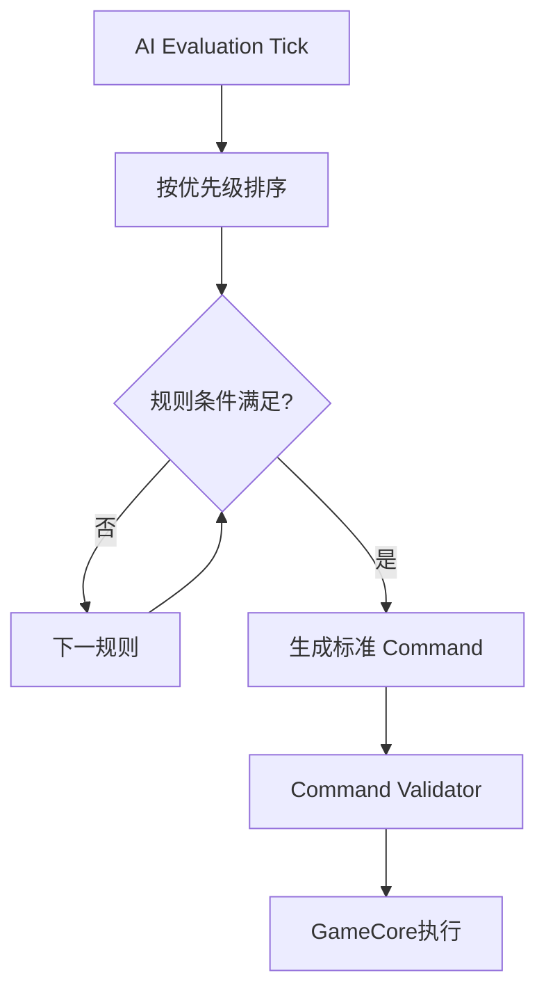

# AI与扩展玩法系统

> **文档规则**：本文件是该主题的唯一主文档；其他文档如需使用本主题规则，应通过链接引用，不复制整段内容。  
> **中文注释**：涉及关键数据结构、算法、不变量、兼容逻辑的代码必须使用中文注释解释原因。  


> 本文件维护 AI、弹药、无人机/战斗艇、研究、装备与库存。战斗底层规则见 `08-战斗与状态系统.md`。

# 20. AI 系统需求

AI 是本项目核心差异化模块。

## 20.1 AI 规则结构

```ts
interface AIRule {
  id: string;
  priority: number;
  enabled: boolean;
  condition: AICondition;
  action: AIAction;
}
```

## 20.2 AI 执行模型



## 20.3 AI 安全原则

禁止执行玩家提供的 JavaScript。

只允许受控 DSL：

```json
{
  "condition": {
    "type": "FRIENDLY_ROOM_HP_LT",
    "value": 0.5,
    "roomTag": "REACTOR"
  },
  "action": {
    "type": "MOVE_TO_TARGET_ROOM"
  }
}
```

## 20.4 R1 AI 条件示例

- 当前房间 HP < X；
- 我方某类房间 HP < X；
- 我方护盾 < X；
- 自身 HP < X；
- 敌方护盾 > X；
- 敌方某类房间存在；
- 当前房间着火；
- 当前房间存在敌人；
- 当前房间需要维修；
- 武器已准备；
- 我方可用能源 > X；
- 目标房间已损毁。

## 20.5 R1 AI 动作示例

- 移动到目标房间；
- 修理当前房间；
- 前往医疗室；
- 扑灭火灾；
- 攻击敌方船员；
- 使用技能；
- 给房间加电；
- 给房间减电；
- 武器攻击指定类别房间；
- 武器攻击最低 HP 房间；
- 武器攻击护盾房；
- 保持当前位置。

## 20.6 AI 频率

AI 不必每 Render Frame 执行，建议每 2～4 个 Game Tick 评估一次，具体频率做配置。

---

---

# 21. 弹药系统需求

弹药定义可包含：

- 制造时间；
- 成本；
- 连射数；
- 连射间隔；
- AOE；
- 系统伤害；
- 船体伤害；
- 船员伤害；
- 护盾伤害；
- 穿甲；
- 速度；
- 火灾；
- EMP。

R1：普通导弹一种，不做制造时间。

R2：弹药库存、制造、不同弹药、AI 切换。

---

---

# 22. 无人机/战斗艇需求

R2/R3 功能。

无人机定义可包含：飞行速度、攻击速度、攻击距离、攻击范围、攻击波次、攻击延迟、重新装填、生命、系统伤害、船体伤害、船员伤害、护盾伤害、穿甲、火灾、EMP、目标类型。

GameCore 负责出击、目标、攻击、HP、返回/销毁；Cocos 负责飞行动画和特效。

---

---

# 23. 科技研究系统

```ts
interface ResearchDefinition {
  id: string;
  prerequisites: string[];
  cost: ResourceCost;
  durationSec: number;
  unlocks: UnlockEffect[];
}
```

可解锁：房间、房间等级、船体、装备、AI 条件、AI 动作、弹药、无人机、功能系统。

R2。

---

---

# 24. 装备与库存

## 24.1 Inventory

服务端权威。

主要类型：Currency、Material、Equipment、Ammo、Consumable、QuestItem、Cosmetic。

## FR-INV-001 数量

所有增减必须生成资源流水。

## FR-INV-002 幂等

领奖、购买、合成必须支持幂等键。

## FR-EQUIP-001 装备

支持装备槽、属性、等级、品质、绑定船员、唯一 ID。R2。

---
