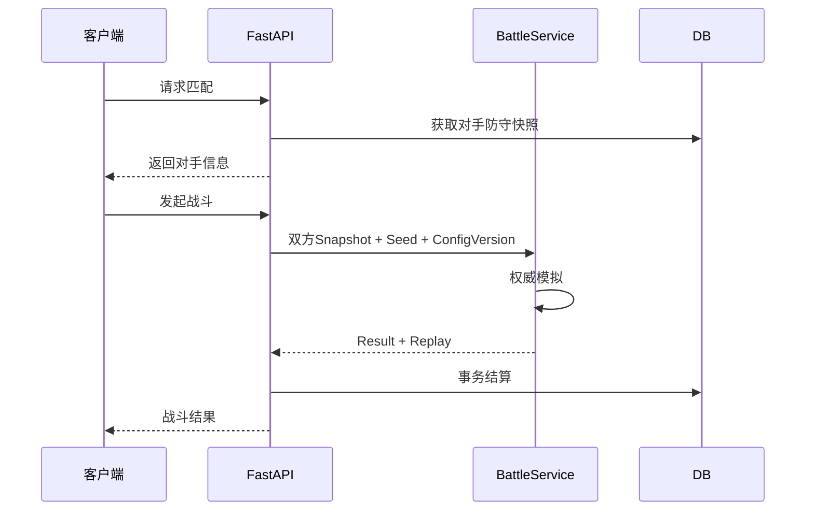

# PvE、PvP、回放与存档

> **文档规则**：本文件是该主题的唯一主文档；其他文档如需使用本主题规则，应通过链接引用，不复制整段内容。  
> **中文注释**：涉及关键数据结构、算法、不变量、兼容逻辑的代码必须使用中文注释解释原因。  


# 25. PvE 系统

## R1

本地预定义敌人，配置包含船体、房间布局、船员、AI、难度和奖励。

## R2

PvE 由服务端发起和结算。

服务端生成：

```text
BattleInstanceId
EnemySnapshot
Seed
ConfigVersion
```

客户端负责表现。

---

---

# 26. 异步 PvP

R2 首期不采用实时锁步 PvP。



服务端不得信任客户端提交的 winner/reward。

---

---

# 27. 战斗回放

## 27.1 回放数据

```ts
interface BattleReplay {
  version: number;
  battleRuleVersion: string;
  configVersion: string;
  seed: string;
  initialState: BattleInitialState;
  commands: TimedCommand[];
  checkpoints?: ReplayCheckpoint[];
  finalHash: string;
}
```

不要默认保存每一帧 Sprite 坐标。

## 27.2 Checkpoint

长回放可以每 N 秒保存逻辑快照，用于快速跳转。

## 27.3 回放功能

完整目标：播放、暂停、1x、2x、4x、重开、时间轴、战斗事件查看、最终状态校验。

R1 至少实现：播放、暂停、1x/2x、重新播放。

---

---

# 28. 游戏存档

## 28.1 本地阶段

R1 开发期通过 `PlayerStatePort` 使用一个玩家状态 Envelope；UI、View 和 GameCore 不直接访问 localStorage。

```ts
interface PlayerStateEnvelope {
  readonly schemaVersion: 1;
  readonly configVersion: string;
  readonly revision: number;
  readonly savedAtUnixMs: number;
  readonly activeShipId: string;
  readonly ships: readonly ShipSnapshot[];
}
```

浏览器适配器只使用 `starship-protocol:dev:player-state:v1`。每次合法 Command 或需要持久的固定 Tick 保存完整 Envelope；写入失败恢复操作前状态。损坏或不兼容数据输出中文警告并回到默认开发状态。

旧 `starship-protocol:r0:ship-layout`、`starship-protocol:r1:energy`、`starship-protocol:r1:crew` 不读取、不迁移，开发数据直接废弃。

## 28.2 联网阶段

R2 服务端为唯一权威存档，HTTP 适配器保持与本地 `PlayerStatePort` 相同的应用层结果结构；客户端本地只做 cache。缓存被删除、替换或解密不能改变服务端账号、库存、奖励或战斗结果。

## 28.3 存档版本

所有存档包含：

```json
{
  "schemaVersion": 1
}
```

正式数据必须准备显式 Migration。当前旧 Prototype 开发 Key 已明确废弃，不为它们增加迁移代码。

---
